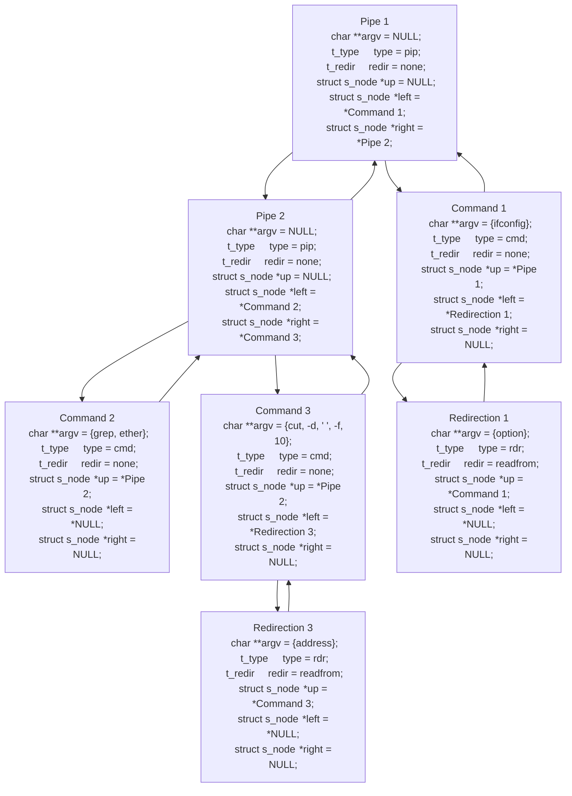

# Minishell
A 42 Paris project


## Subject
Minishell is a level 03 project at 42 Paris and an emblematic exercice for any computer science student.

The subject is pretty straightforward : Recode a (limited version) POSIX Shell in C.

The scope is fully 'functionnal' as we were not required to code any graphic interface (opening a new window, etc) but 'only' interpret and execute the instruction(s) given in the prompt line `➜  Minishe·elle `.
The `./minishell` program is able to run most of the basic instructions a shell can handle, such as echo, ls, cat, cd, mkdir... and even run other executable such as previous 42 projects (think push_swap, fdf, etc).
A set of basic commands also have to be recoded inside our program, to be able to run basic instructions even when `./minishell` is launched without any environment variables (but we'll get on that later on).
If you have any questions - shoot us an email or ping us on Discord, we'll be happy to help!
 
## Wonderwomen

Minishell is the first group project (within the common core curriculum of 42), which has to be done in pairs. The point of working on a group project is to emulate real life work - where we'll have to work on projects with bigger scopes and review code or get our own code reviewed. Which is why, when working with one or several persons, knowing exactly each other's scope is key to avoid any overlapping or redundancy. Another key learning point was the use of git (branching, merging, etc). By the way, the first thing we did was a [git crash course](https://learngitbranching.js.org/?locale=en).

I was very happy Tiffany asked me to become her Minishell mate! We were lucky enough to be coding in a very similar way so working together and reviewing eachother's code was a breeze! Our respective professionnal experience was also an asset for us as we apprehended this big piece of a project from a macro perspective first. And on a more personnal level - we became really good friends. So thank you Tiffany !

**We divided the project in roughly 2 main chunks : parsing and execution**

|**[Tiffany](https://github.com/ImJustWan)**|**[Marie](https://github.com/Makasabi)**|
|---|---|
|Prompt|Environment variables|
|Parsing (Token, Lexer, Expansion, Binary tree)|Builtins|
|Pseudo Heredoc|Execution (simple and compplex commands)|
|Signal handling|Exit Status|

____

## Project's Architecture

As mentionned previously, we apprehended this project from a macro perspective. 
We started by creaing a general workflow for our project, hence avoiding any redundancy in our code but also to anticipate the type of data we'd be sending from the parsing phase to the execution phase.

#### Parsing
This section starts at the command line which is entered after the prompt `➜  Minishe·elle `.
At this point it is a mere string of characters, and it becomes a glorious binary (or 'syntax') tree.
#### Execution
This bit will use all the formated data of the tree to execute every single commands and redirections.

Here is a global representation of the general structure of our code : 


**You can see it in extensive details [here](https://miro.com/app/board/uXjVM2vuNQE=/?share_link_id=828445432809)**.

## Key Learning Points

1. [Readline - Collecting instructions from prompt line](https://github.com/Makasabi/minishell_42/blob/main/README.md#1-readline---collecting-istructions-from-the-prompt-line)
2. [Parsing] (https://github.com/Makasabi/minishell_42/blob/main/README.md#2-parsing---how-to-create-an-ast-from-scratch)
   	1. Lexer - divide command string in tokens
   	2. Expander - replace variables with their value
   	3. Parser - analyse tokens and store them in nodes
   	4. Pseudo Heredoc - create a temporary file, directly in the prompt
   	5. Tree builder - organise nodes in a logical way
3. Signals handling
4. [Environment variables](https://github.com/Makasabi/minishell_42/blob/main/README.md#4-environment-variables)
5. Execution
   	1. Builtins
   	2. Running binary executable form minishell
   	3. Piped commands
   	4. Redirections
   	5. Paths and Access rights
   	6. Exit status
6. External Ressources 

## 1. Readline - Collecting instructions from the prompt line

## 2. Parsing - How to create an AST from scratch

AST stands for Abstract Syntax Tree ; to explain the functionning of it, we can make a parallel with regular grammar, as also works in a syntax tree. 

_Shoutout to Chomsky for that part_

Let's take an example : "Jade reads a book."

This sentence is `formal language`, which means it's an ensemble of letters from an alphabet, forming words, etc.
Grammar looks at this phrase in a more abstract way : 

S (sentence) = Jade reads a book
NP (noun phrase) = Jade
VP (verb phrase) = reads a book

It can be illustrated in a tree that way :

            S
            |
          /   \
        NP     VP
      (Jade)  (reads a book)

The difference between formal language and grammar is this abstraction - it doesn't actually matter what details are put in those noun or verb phrases.

This sentence would have the exact same AST : "The wonderfully smart, brilliant and stunningly funny Jade reads a book written by no one else than Brandon Sanderson, fantasy genius of our times."

I'm getting carried away, but bear with me, we're getting there.

The exact same principle applies to shell commands. In the end, it doesn't really matter _what_ the words are : we just need to be able to break it down and find a categorization that fits and allows us to build a tree around it.


We sat down and got to work : bash's AST is extensive, so we drew inspiration from it.

PIPE : highest point of the tree, works as a pivot point in the code
REDIR : always starts with either < or > , to be broken down in different types after
COMMAND : basically all the rest, whether it is a simple command, or a complex one with multiple options and arguments

Here's a quick command example, let's make a tree out of it !

`cat < Makefile | wc -l >> "out file"`

1. Lexer - divide command string in tokens

This is where the actual parsing (or at least the coding part of it) began.

The first step was a chained list of tokens. Basically, everything either `|`, `<` or `>` gets its own token, with the type PIPE or corresponding redirection name (input, output, heredoc or append). Everything else is put in an ARG token.
Once this list is created, a quick run through this list helps with some cleaning
+ Every ARG after a REDIR becomes said REDIR name
+ Quotes are deleted (while keeping a flag to differenciate between single and double quotes)

Our example now looks like this :

 ARG  REDIR   ARG-REDIR  PIPE   ARG   ARG  REDIR     ARG-REDIR
`cat`  `<`    `Makefile`  `|`   `wc`  `-l`  `>>`   `out file`

2. Expander - replace variables with their value

3. Parser - analyse tokens and store them in nodes

Now that we have that : let's go on with the nodes.

The first step of this part is rather simple : we create a new chained list (different s_type for clarity), with standard next and prev pointers.
+ PIPE tokens get a PIP node
+ REDIR tokens and their ARG name go into a RDR node, with the name as a variable
+ bewteen two pipes : every unused ARG create the char ** of a CMD node

Here's our example in nodes : 

       t_type         cmd        rdr    pip   cmd     rdr
       t_redir                 _input_              _append_
       char **argv   (cat)   (Makefile)       (wc)  (out file)
                                              (-l)

Notice how we
+ lost the symbol for redirections, using only the type
+ PIPE node became only a pip node, no more formal language is used

Once again, the main goal of the AST is to strip the language to its more abstract form.

4. Pseudo Heredoc - create a temporary file, directly in the prompt

5. Tree builder - organise nodes in a logical way

Now, the only thing left is to create our now infamous tree.

Hierarchy is primordial : 
+ pip nodes are the highest pivot point
+ everything on the left of a pipe in a command will be on the left in the tree
(+ bewteen pipes, every redir is linked to the same command)

`cat < Makefile | wc -l >> "out file"`

First, pip : 

          pip

It's the only one, so each command goes respectively on its left and right

          pip
        /    \
     cmd      cmd

For each command, their redirection is linked on its left
    
             pip
           /    \
        cmd      cmd
       /        /
    rdr      rdr

For funnsies, here's the command we played around with when conceptualizing our AST :

`ifconfig < option | grep ether | cut -d ' ' -f 10 > address`

tokens : 
   ARG     REDIR  ARG-REDIR  PIPE   ARG     ARG   PIPE   ARG   ARG  ARG   ARG    ARG  REDIR  ARG-REDIR
`ifconfig`  `<`    `option`   `|`  `grep` `ether`  `|`  `cut` `-d`  ` `  `-f`   `10`  `>`   `address`

nodes :

t_type          cmd         rdr     pip   cmd     pip   cmd     rdr
t_redir                   _input_                             _output_
char **argv   (ifconfig)  (option)       (grep)         (cut) (address)
                                         (ether)        (-d)
                                                        ( )
                                                        (-f)
                                                        (10)


## 4. Environment variables

Enrionment vairiables are very similar to variables you'd be using in your code as their respective values can be used when called in functions. 
Here are a few examples you may know:
+ `$PATH`: if you've previously worked on Pipex project, you sure have used it in order to execute a command with the function `execve`.
+ `$USER`: is used when generating your source file header.
+ `$HOME`: is used by `cd` when no arguments are entered.
+ `$PWD` & `$OLDPWD`: are both updated when we change directory with the cd command.
+ `$SHLVL`: is incremented everytime an instance of shell is launched within another one.

You can easily check the value of an environment variable with the command `echo $VARNAME`

the environment of shell is a collection of many variables, and luckily you don't have to set the entire environment yourself.
You can 'import it' from your main function arguments `int main(int argc, char ** argv, char ** envp)` or by importing it from an external variable ```extern char	**environ```.
if you are launching `./minihsell` with `env -i`: you are setting the envp/environ to a one line 2D array that is set to NULL; In this particular case, you'll need to make sure your program can run without crashing and run builtins.

You'll have to store your'e environment variable somehere easily accessible throughout youre code. 
In our project, we decided to duplicate the environment 2D char array and to have it saved on the heap. 

Finally, you will also need to code functions to modify your environment: add, remove, edit, find, extract value of a variable. 


Sujet :
https://cdn.intra.42.fr/pdf/pdf/90159/fr.subject.pdf

Google doc:
https://docs.google.com/document/d/1c7IVm0a13f6dmQzApheV4Y5r8KLZjx6FE1nGeYV0tWI/edit?usp=sharing

Documentation
https://www.cs.purdue.edu/homes/grr/SystemsProgrammingBook/Book/Chapter5-WritingYourOwnShell.pdf

Git Branching
https://learngitbranching.js.org/?locale=fr_FR

git branch <nom de la branche> => Pour creer une nouvelle branhce
git checkout <nom de la branche> => Pour se pocitionner dans cette branche specifiquement
git merge <nom de la branche> => merge deux commit de deux branches ensemble
git checkout <nom de la branche> | git merge main => merge le contenu de main dans le nom de la branche dans laquelle on se trouve
git rebase =>
git checkout HEAD~4 => remonte HEAD au 4eme parent.
git branch -f main HEAD~3 => bouge (de force : -f) la branche main à trois parents derrière HEAD.
git branch -f <branche d'origine> <branche de destination> => permet de forcer l'emplacement d'une branche
git cherry-pick <commit#> .... <commit #> => On choisi les commit a inclure dans la branche dans laquelle on se trouve actuellement
git rebase -i <where I want to reorganise my commit from>
git commit --amend => Petite modification sur un commit existant (C2 devent C2')
git tag "nom du tag" <commit> => on pointe vers une milestone a laquelle on pourra se referer plus tard. On l'utilise par exemple pour referer a une version du programme
git describe => decrit le statut de chque commit avec ses tag


GIT REMOTE
git clone => clone le repo sur notre machine locale avec la meme tructure de commit et de branches
git fetch => reccupere les commit et branches presentes dans le git distant mais pas dans le notre
			-> The key difference between git fetch and pull is that git pull copies changes from a remote repository directly into your working directory, while git fetch does not. The git fetch command only copies changes into your local Git repo. The git pull command does both.
git checkout -b totallyNotMain o/main => Cette commande crée une nouvelle branche nommée totallyNotMain et la configure pour suivre o/main.
git branch -u o/main foo =>
git push origin <source>:<destination> =>
git fetch origin <source>:<destination> =>
git pull origin <source>:<destination> = git fetch origin <source>:<destination> ; git merge <destination>

My_env usage:
-> use pointer to address of 2D array (***)"my env" for all functions that may alter it's content (variables).
-> For read only function, simple pointer to 2D array (**) can be used.


